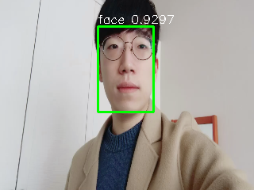

# Face detection

This repo is based on [this repo](https://github.com/PureHing/face-mask-detection-tf2)

This model is a lightweight face mask detection model. Based on ssd,the backbone is Mobilenet and RFB.
 

<!-- ## Key Features

- [x] Tensorflow 2.1
- [x] Trainging and Inference
- [x] Precision with mAP
- [x] Eager mode training with `tf.GradientTape`
- [x] Network function with `tf.keras`
- [x] Dataset prepocessing with `tf.data.TFRecordDataset` -->

<!-- ```bash
├── assets
│   ├── 1_Handshaking_Handshaking_1_71.jpg
│   ├── out_1_Handshaking_Handshaking_1_71.jpg
│   ├── out_test_00002330.jpg
│   └── test_00002330.jpg
├── checkpoints
│   └── weights_epoch_120.h5
├── components
│   ├── config.py
│   ├── __init__.py
│   ├── kmeans.py
│   ├── prior_box.py
│   └── utils.py
├── dataset
│   ├── check_dataset.py
│   ├── tf_dataset_preprocess.py
│   ├── train_mask.tfrecord
│   ├── trainval_mask.tfrecord
│   ├── val_mask.tfrecord
│   ├── voc_to_tfrecord.py
├── inference.py
├── logs
│   └── train
├── mAP
│   ├── compute_mAP.py
│   ├── detection-results
│   ├── detect.py
│   ├── ground-truth
│   ├── __init__.py
│   ├── map-results
│   └── README.md
├── Maskdata
│   ├── Annotations
│   ├── ImageSets
│        └── Main
│   │       ├── train.txt
│   │       ├── trainval.txt
│   │       └── val.txt
│   └── JPEGImages
├── network
│   ├── __init__.py
│   ├── losses.py
│   ├── model.py
│   ├── net.py
│   ├── network.py
├── README.md
└── train.py
└── requirements.txt
``` -->

## Usage

### Installation

Create a new python virtual environment by [Anaconda](https://www.anaconda.com/) ,`pip install -r requirements.txt`

### Data Preparing

1. Wider Face Data

  Run wider face download script
  ```bash
    python data_downloader.py
  ```

  Unzip dataset
  ```bash
    cd widerface
    unzip -qq WIDER_train.zip
    unzip -qq WIDER_val.zip
    unzip -qq WIDER_test.zip
    unzip -qq wider_face_split.zip
  ```
  #### If you get error during unzip, download files in following links to widerface folder.
  * [WIDER_train.zip](https://drive.google.com/file/d/0B6eKvaijfFUDQUUwd21EckhUbWs/view)
  * [WIDER_val.zip](https://drive.google.com/file/d/0B6eKvaijfFUDd3dIRmpvSk8tLUk/view)
  * [WIDER_test.zip](https://drive.google.com/file/d/0B6eKvaijfFUDbW4tdGpaYjgzZkU/view)
  * [wider_face_split.zip](http://mmlab.ie.cuhk.edu.hk/projects/WIDERFace/support/bbx_annotation/wider_face_split.zip)

2. Data Processing

   + Convert the training images and annotations to tfrecord file with the the script bellow.

     ```bash
     python dataset/voc_to_tfrecord.py
     ```

### With your dataset(COCO style annotation)

1. Place your images and annotations in my_dataset folder
    ```bash
    my_dataset
    ├── my_image1.jpg
    ├── my_image1.xml
    ├── my_image2.jpg
    ├── my_image2.xml
    ├── ...
    └── ...
    ```

2. Data Processing
   + Convert your dataset to tf record
   ```bash
     python dataset/voc_to_tfrecord.py
     ```

### Training

1. Train the model by run `python train.py` .

### Inference

+ Run on video

  ```bash
  python inference.py  --model_path checkpoints/ --camera True
  or
  python inference.py  --model_path checkpoints/*.h5 --camera True
  ```

+ Detect on Image

  ```bash
  python inference.py  --model_path checkpoints/ --img_path assert/1_Handshaking_Handshaking_1_71.jpg
  ```
  * Check the output file in assets/ folder.

  
